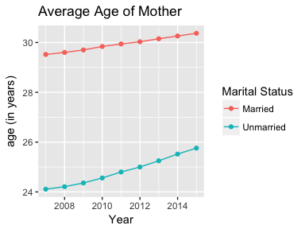
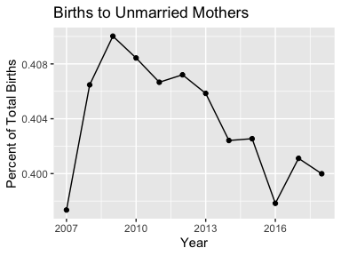

# wonderapi
Joyce Robbins  
2017-08-28  

  


```r
library(dplyr)
library(ggplot2)
library(tidyr)
library(wonderapi)
```

## Overview
This package makes it easier to use the CDC Wonder API.  It does so by employing hidden default query lists and lookup tables, allowing users to focus only on the variables they're interested in obtaining, and to write queries using human readable names rather than numeric codes.

`getData()`

* converts the user's parameter requests to codes  
* adds these codes to the default query list  
* calls `wondr::make_query` to obtain query results
* processes the results  
* returns a tidy data frame  

### Example


```r
mylist <- list(list("And By", "Gender"))
mydata0 <- getData(TRUE, "Detailed Mortality", mylist)
```


```r
mydata0 %>% head()
```

```
## # A tibble: 6 x 5
##    Year Gender Deaths Population `Crude Rate`
##   <dbl>  <chr>  <dbl>      <dbl>        <dbl>
## 1  1999 Female 270710  142237295        190.3
## 2  1999   Male 292346  136802873        213.7
## 3  2000 Female 273995  143368343        191.1
## 4  2000   Male 292630  138053563        212.0
## 5  2001 Female 273633  145077463        188.6
## 6  2001   Male 293803  139891492        210.0
```


`show_databases()` displays available databases by name and code:  


```r
wonderapi::show_databases()
```

```
## # A tibble: 5 x 2
##                      label  name
##                      <chr> <chr>
## 1 Natality for 1995 - 2002   D10
## 2 Natality for 2003 - 2006   D27
## 3 Natality for 2007 - 2015   D66
## 4       Detailed Mortality   D76
## 5           Heat Wave Days  D104
```

More databases will be added in the future.  

The best way to become familiar with CDC Wonder API options is to use the web interface: [https://wonder.cdc.gov](https://wonder.cdc.gov), as the options available through the API are nearly identical. The greatest difference is that location variables are not available through the API.  

## Installation

This package is not on CRAN. It can be installed from Github with the `devtools` package:

```r
devtools::install_github("socdataR/wonderapi", build_vignettes = TRUE)
```

(The vignettes are an important component of the package as the codebooks are stored as vignettes, so be sure to include `build_vignettes = TRUE`.)  

## Getting started

Queries are composed of parameter name-value pairs.  Setting up a query without assistance is complex because the query must be submitted as an .xml file with a long list of required parameters, such as [here (Example 1)](https://wonder.cdc.gov/wonder/help/API-Examples/D76_Example1-req.xml) and [here (Example 2)](https://wonder.cdc.gov/wonder/help/API-Examples/D76_Example2-req.xml). The point of the package is to prevent your having to create requests in this form.  It relies on the `wondr` package which creates converts R lists to xml and makes the query. The value of this package is in the "pre" and "post" stages of the query, that is, the processes of setting up the query and tidying the results.  

### Codebooks

Codebooks are provided as package vignettes to allow the user to conveniently look up the names and values of available parameters in each dataset.  They may be accessed quickly by typing:  


```r
> ??codebook
```

in the console, or searching for "`codebook`" in the Help window. The codebooks are an important contribution of the package and are not provided by the CDC.  They are generated automatically by [this script](https://github.com/socdataR/wonderapi/blob/develop/R/make_codebook_vignette.R), which scrapes the CDC Wonder web interface form, and displays parameter names and values in human readable form.  The benefit of this method is the ability to quickly produce and update codebook vignettes that closely follow the web interface, with parameters appearing in the same order.  It also means, however, that the codebooks contain more information than the typical user needs to submit a query.  Most users will only need Group By variables (codes beginning with "B_"), Measures (codes beginning with "M_"), and Limiting Variables (codes beginning with "V_"). 

Although some of the parameter names are long and/or awkward, for the sake of consistency, we follow the CDC names exactly. **The only exception is that any content that appears in parentheses should be dropped.** For example, "Fertility Rate" can be substituted for "M_5", but "Fertility Rate (Census Region, Census Division, HHS Region, State, County, Year, Age of Mother, Race) cannot.

### Default query lists and requests  

To facilitate the process of designing a query list, this package relies on default query lists. Each default query is set to request a single Group By Results parameter, generally set to `"Year"`. It is set to request the Measures that are listed as default Measures on the web interface (i.e. `Births` for [the Births dataset](https://wonder.cdc.gov/controller/datarequest/D76); `Deaths`, `Population` and `Crude Rate` for the [Detailed Mortality dataset](https://wonder.cdc.gov/controller/datarequest/D76).) To see the default settings, perform a query request without specifying a querylist: 


```r
natdata <- getData(TRUE, "Natality for 2007 - 2015")
natdata %>% head()
```

```
## # A tibble: 6 x 2
##    Year  Births
##   <dbl>   <dbl>
## 1  2007 4316233
## 2  2008 4247694
## 3  2009 4130665
## 4  2010 3999386
## 5  2011 3953590
## 6  2012 3952841
```

```r
dmdata <- getData(TRUE, "Detailed Mortality")
dmdata %>% head()
```

```
## # A tibble: 6 x 4
##    Year Deaths Population `Crude Rate`
##   <dbl>  <dbl>      <dbl>        <dbl>
## 1  1999 563056  279040168        201.8
## 2  2000 566625  281421906        201.3
## 3  2001 567436  284968955        199.1
## 4  2002 570563  287625193        198.4
## 5  2003 570453  290107933        196.6
## 6  2004 567458  292805298        193.8
```


The default lists were prepared based on CDC examples, but we make no claim that they are error free. If you have any suggestions for improving them, please make a pull request on Github or [send an email to Joyce Robbins](mailto:joycerobbins1@gmail.com). The default lists are available [here](https://github.com/socdataR/wonderapi/tree/master/data-raw).

## Creating customized queries  

There are different types of parameters.  Most critical are Group Results By and Measures. The Group Results By parameters serve as keys for grouping the data; the maximum number of Group Results By parameters is five. Limiting Variables may also be used to constrain results behind the scenes.

To make changes to the default list, first create a list of lists, wherein each nested list is a name-value pair.  For example, the following changes the first (and currently only) "Group Results By" variable to Weekday:


```r
mylist <- list(list("Group Results By", "Weekday"))
mydata <- getData(TRUE, "Detailed Mortality", mylist)
```


```r
mydata %>% head()
```

```
## # A tibble: 6 x 4
##     Weekday  Deaths     Population   `Crude Rate`
##       <chr>   <dbl>          <chr>          <chr>
## 1    Sunday 1399754 Not Applicable Not Applicable
## 2    Monday 1388343 Not Applicable Not Applicable
## 3   Tuesday 1399020 Not Applicable Not Applicable
## 4 Wednesday 1411749 Not Applicable Not Applicable
## 5  Thursday 1420597 Not Applicable Not Applicable
## 6    Friday 1435379 Not Applicable Not Applicable
```


As the set up is slightly different depending on the parameter type, more details on setting up the name-value pairs by parameter types are provided below.

### Group By variables  

Each dataset allows for fixed number (5 or fewer) Group By variables, codes for which are `"B_1", "B_2", "B_3",` etc. `"Group By Results"` may be substituted for `"B_1"` and `"And By"` for `"B_2"`. `"And By`" may **not**, however, be substituted for `"B_3"` on to avoid ambiguity (this may change in the future.) Values -- in this case, the Group By variables -- may be specified by code or human readable name. The following, thus, are equivalent:


```r
## not run
mylist <- list(list("B_1", "D66.V2"))
mylist <- list(list("Group Results By", "Race"))
mylist <- list(list("B_1", "Race"))
mylist <- list(list("Group Results By", "D66.V2"))
```

See the appropriate codebook for all Group By options.  

### Measures
Measures do not need values; it is sufficient to specify a name only:


```r
mylist <- list(list("Group Results By", "Marital Status"),
               list("And By", "Year"),
               list("Average Age of Mother", ""))
mydata2 <- getData(TRUE, "Natality for 2007 - 2015", mylist)
```


```r
mydata2 %>% head()
```

```
## # A tibble: 6 x 4
##   `Marital Status`  Year  Births `Average Age of Mother`
##              <chr> <dbl>   <dbl>                   <dbl>
## 1          Married  2007 2601186                   29.52
## 2          Married  2008 2521128                   29.60
## 3          Married  2009 2437007                   29.70
## 4          Married  2010 2365915                   29.84
## 5          Married  2011 2345817                   29.94
## 6          Married  2012 2343222                   30.03
```


### Limiting variables
Queries can be constrained with parameters that limit results in the background.  For example, if you're only interested in February births, you may choose to limit results to February as follows, rather than grouping by Month:


```r
mylist <- list(list("Month", "2"))
getData(TRUE, "D66", mylist)
```

```
## # A tibble: 9 x 2
##    Year Births
##   <dbl>  <dbl>
## 1  2007 326891
## 2  2008 338521
## 3  2009 316641
## 4  2010 301994
## 5  2011 297961
## 6  2012 304505
## 7  2013 291748
## 8  2014 298404
## 9  2015 298058
```

**Note that values for Limiting Variables must be entered as codes; in this case "2" rather than "February."  We hope to add capability for human readable values in the future.**

### Plotting query results  

By returning a tidy data frame, the query results are ready to be plotted without any additional data manipulation:  


```r
ggplot(mydata2, aes(x = Year, y = Births, color = `Marital Status`)) +
    geom_line() + ggtitle("Births by Marital Status")
```


```r
ggplot(mydata2, aes(x = Year, y = `Average Age of Mother`,
                   color = `Marital Status`)) + geom_line() +
    geom_point() + ylab("age (in years)") + 
    ggtitle("Average Age of Mother")
```




```r
mydata2 <- mydata2 %>% 
    select(-`Average Age of Mother`) %>% 
    spread(key = `Marital Status`, value = `Births`) %>% 
    mutate(Total = Married + Unmarried)
ggplot(mydata2, aes(x = Year, y = Unmarried / Total)) + geom_line() +
    geom_point() + ggtitle("Births to Unmarried Mothers") +
    ylab("Percent of Total Births")
```



### Combining results from multiple datasets
Some of the datasets, such as the Births, are divided into multiple databases by time period. `wonderapi` makes it easy to combine the data into one data frame. (Care needs to be taken as the variables are not identical in all. For example, the 1995 - 2002 dataset does not have any measure options; it only returns number of births. To find out what's available, see the codebooks (**`>??codebook`**) and crosscheck with the [CDC Wonder API web interface](https://wonder.cdc.gov).)  


```r
births <- rbind(getData(TRUE, "Natality for 1995 - 2002"),
                getData(TRUE, "Natality for 2003 - 2006"),
                getData(TRUE, "Natality for 2007 - 2015"))
ggplot(births, aes(Year, Births)) + geom_line() + 
    ggtitle("U.S. Births by Year, 1995 - 2015")
```


### Errors

The main source of errors is improper query requests. The `wonderapi` has limited ability to catch problems before the query request is made. It checks the list of parameter names and will reject the name-value pair if the _name_, either in code or human readable form, is not recognized. (Checking for _value_ problems will be added in the future.) Here is an example of an unrecognized parameter name:  


```r
mydata3 <- getData(TRUE, "Detailed Mortality", 
        list(list("Suspect", "Mrs. Peacock")))
```

```
## Ignoring: "Suspect",...(not recognized)
```


```r
mydata3 %>% head()
```

```
## # A tibble: 6 x 4
##    Year Deaths Population `Crude Rate`
##   <dbl>  <dbl>      <dbl>        <dbl>
## 1  1999 563056  279040168        201.8
## 2  2000 566625  281421906        201.3
## 3  2001 567436  284968955        199.1
## 4  2002 570563  287625193        198.4
## 5  2003 570453  290107933        196.6
## 6  2004 567458  292805298        193.8
```


Errors due to the constraints of the CDC Wonder API are more difficult to catch since there are many quirky rules and it is currently beyond the scope of this package to check for them. The following, for example, appears to be a reasonable request, but results in an error:  


```r
mylist <- list(list("And By", "Education"), 
               list("Birth Rate", ""))
mydata4 <- getData(TRUE, "Natality for 2007 - 2015", mylist)
```

```
## Error in wondr::make_query(querylist, dbcode): Internal Server Error (HTTP 500).
```

In this case, the best approach is to visit the [CDC Wonder API web interface](https://wonder.cdc.gov) and try the same query. If all goes well, you will receive more detailed information on what went wrong:  

<center></center>

We learn that we can't include "Education" if we request the "Birth Rate" measure. If we try again with "Race" instead of "Education", it works:  


```r
mylist <- list(list("And By", "Race"), 
               list("Birth Rate", ""))
mydata5 <- getData(TRUE, "Natality for 2007 - 2015", mylist)
```


```r
mydata5 %>% head()
```

```
## # A tibble: 6 x 5
##    Year                             Race  Births `Total Population`
##   <dbl>                            <chr>   <dbl>              <dbl>
## 1  2007 American Indian or Alaska Native   49443            3829898
## 2  2007        Asian or Pacific Islander  254488           15559373
## 3  2007        Black or African American  675676           40451108
## 4  2007                            White 3336626          241390828
## 5  2008 American Indian or Alaska Native   49537            3983929
## 6  2008        Asian or Pacific Islander  253185           16094699
## # ... with 1 more variables: `Birth Rate` <dbl>
```


