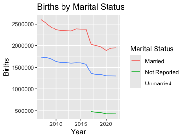
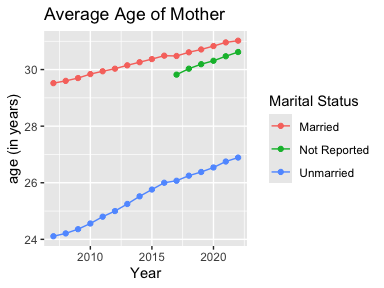
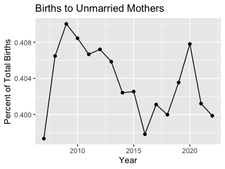
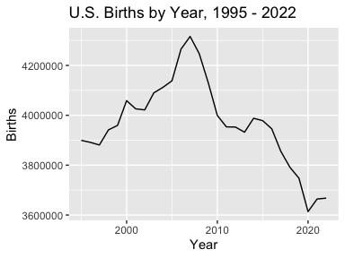

Introduction to wonderapi
================
Joyce Robbins
2024-03-15

<div id="TOC">
<ul>
<li>
<a href="#overview">Overview</a>
</li>
<li>
<a href="#installation">Installation</a>
</li>
<li>
<a href="#main-functions">Main functions</a>
</li>
<li>
<a href="#getting-started-with-send_query">Getting started with
`send_query()`</a>
</li>
<li>
<a href="#getting-started-with-getdata">Getting started with
`getData()`</a>
</li>
<ul>
<li>
<a href="#codebooks">Codebooks</a>
</li>
<li>
<a href="#default-query-lists-and-requests">Default query lists and
requests</a>
</li>
<li>
<a href="#creating-customized-queries">Creating customized queries</a>
<li>
<a href="#group-by-variables">Group By variables</a>
</li>
<li>
<a href="#measures">Measures</a>
</li>
<li>
<a href="#limiting-variables">Limiting variables</a>
</li>
<li>
<a href="#plotting-query-results">Plotting query results</a>
</li>
<li>
<a href="#combining-results-from-multiple-datasets">Combining results
from multiple datasets</a>
</li>
<li>
<a href="#errors">Errors</a>
</li>
</ul>
</ul>
</div>

``` r
library(tidyverse)
library(wonderapi)
```

## Overview

This package makes it easier to use the [CDC WONDER
API](https://wonder.cdc.gov/wonder/help/WONDER-API.html): 1) users can
write simple queries using human readable names rather than numeric
codes, and 2) users receive data in a tidy data frame that is easy to
work with.

NOTE, HOWEVER, THAT THE CDC DOES NOT ALLOW QUERIES WITH LOCATION FIELDS
THROUGH THE API. If you wish to limit or group results by Region,
Division, State or County, or Urbanization, use the [CDC
Wonder](https://wonder.cdc.gov/) web interface rather than the API –
either with or without this package. For more information on this
limitation, see: <https://wonder.cdc.gov/wonder/help/WONDER-API.html>.

## Installation

This package is not on CRAN. It can be installed from Github with the
`remotes` package:

``` r
remotes::install_github("socdataR/wonderapi", build_vignettes = TRUE)
```

(If you have trouble installing the vignettes, or prefer not to, you can
access them on [the package
website](https://socdatar.github.io/wonderapi/) under the Articles tab
instead.)

## Main functions

`send_query()` – takes as input an `.xml` file exported from the CDC
Wonder web interface

`getData()` – takes as input an R list of query options

`show_databases()` displays available databases by name and code:

``` r
wonderapi::show_databases()
```

    ## # A tibble: 7 × 2
    ##   label                               name 
    ##   <chr>                               <chr>
    ## 1 Natality for 1995 - 2002            D10  
    ## 2 Natality for 2003 - 2006            D27  
    ## 3 Natality for 2007 - 2022            D66  
    ## 4 Natality for 2016 - 2022 (expanded) D149 
    ## 5 Detailed Mortality                  D76  
    ## 6 Provisional Multiple Cause of Death D176 
    ## 7 Heat Wave Days                      D104

(Applies only to `getData()`. Any database can be used with
`send_query()`.)

More databases will be added in the future.

The best way to become familiar with [CDC WONDER
API](https://wonder.cdc.gov/wonder/help/WONDER-API.html) options is to
use the [CDC WONDER](https://wonder.cdc.gov) web interface, as the
options available through the API are nearly identical (except for the
location variable limitation – see above).

## Getting started with `send_query()`

This function requires an `.xml` query request file. To obtain this
file, create a query on [CDC WONDER](https://wonder.cdc.gov/). Before
clicking “Send”, uncheck the “Show totals” button at the bottom, and
take note of the database code starting with “D” at the end of the URL.

After sending the query, click the “API Options” tab and then the
“Export API” button to download the query `.xml`.

Once you have this file, you can use it with the `send_query()`
function:

``` r
send_query("D76", "vignettes/Underlying Cause of Death, 1999-2020_1710519087439-req.xml")
```

    ## # A tibble: 44 × 5
    ##    Year  Gender Deaths Population `Crude Rate`
    ##    <chr> <chr>   <dbl>      <dbl>        <dbl>
    ##  1 1999  Female  12291    1932563          6.4
    ##  2 1999  Male    15646    2026854          7.7
    ##  3 2000  Female  12317    1981845          6.2
    ##  4 2000  Male    15718    2076969          7.6
    ##  5 2001  Female  12091    1968011          6.1
    ##  6 2001  Male    15477    2057922          7.5
    ##  7 2002  Female  12317    1963747          6.3
    ##  8 2002  Male    15717    2057979          7.6
    ##  9 2003  Female  12123    1996415          6.1
    ## 10 2003  Male    15902    2093535          7.6
    ## # ℹ 34 more rows

## Getting started with `getData()`

Queries are composed of parameter name-value pairs:

``` r
mylist <- list(list("And By", "Gender"))
mydata0 <- getData("Detailed Mortality", mylist)
head(mydata0)
```

    ## # A tibble: 6 × 5
    ##   Year  Gender  Deaths Population `Crude Rate`
    ##   <chr> <chr>    <dbl>      <dbl>        <dbl>
    ## 1 1999  Female 1215860  142237295         855.
    ## 2 1999  Male   1175183  136802873         859 
    ## 3 2000  Female 1225706  143368343         855.
    ## 4 2000  Male   1177289  138053563         853.
    ## 5 2001  Female 1232913  145077463         850.
    ## 6 2001  Male   1183090  139891492         846.

### Codebooks

Codebooks are provided as package vignettes to allow the user to
conveniently look up the names and values of available parameters in
each dataset. They may be accessed quickly by typing:

``` r
> ??codebook
```

in the console, or searching for “`codebook`” in the Help window. They
are also available under the “Articles” tab of the [package
website](https://socdatar.github.io/wonderapi/).

The codebooks are an important contribution of the package and are not
provided by the CDC. They are generated automatically by [this
script](https://github.com/socdataR/wonderapi/blob/main/R/make_codebook_vignette.R),
which scrapes the [CDC WONDER](https://wonder.cdc.gov/) web interface
form, and displays parameter names and values in human readable form.
The benefit of this method is the ability to quickly produce and update
codebook vignettes that closely follow the web interface, with
parameters appearing in the same order. It also means, however, that the
codebooks contain more information than the typical user needs to submit
a query. Most users will only need Group By variables (codes beginning
with “B\_”), Measures (codes beginning with “M\_”), and Limiting
Variables (codes beginning with “V\_”).

Although some of the parameter names are long and/or awkward, for the
sake of consistency, we follow the CDC names exactly. **The only
exception is that any content that appears in parentheses should be
dropped.** For example, “Fertility Rate” can be substituted for “M_5”,
but “Fertility Rate (Census Region, Census Division, HHS Region, State,
County, Year, Age of Mother, Race) cannot.

### Default query lists and requests

To facilitate the process of designing a query list, this package relies
on default query lists. Each default query is set to request a single
Group By Results parameter, generally set to `"Year"`. It is set to
request the Measures that are listed as default Measures on the web
interface (i.e. `Births` for [the Births
dataset](https://wonder.cdc.gov/controller/datarequest/D76); `Deaths`,
`Population` and `Crude Rate` for the [Detailed Mortality
dataset](https://wonder.cdc.gov/controller/datarequest/D76).) To see the
default settings, perform a query request without specifying a
querylist:

``` r
natdata <- getData("Natality for 2007 - 2022")
head(natdata)
```

    ## # A tibble: 6 × 2
    ##    Year  Births
    ##   <dbl>   <dbl>
    ## 1  2007 4316233
    ## 2  2008 4247694
    ## 3  2009 4130665
    ## 4  2010 3999386
    ## 5  2011 3953590
    ## 6  2012 3952841

``` r
dmdata <- getData("Detailed Mortality")
head(dmdata)
```

    ## # A tibble: 6 × 4
    ##   Year   Deaths Population `Crude Rate`
    ##   <chr>   <dbl>      <dbl>        <dbl>
    ## 1 1999  2391043  279040168         857.
    ## 2 2000  2402995  281421906         854.
    ## 3 2001  2416003  284968955         848.
    ## 4 2002  2443030  287625193         849.
    ## 5 2003  2447946  290107933         844.
    ## 6 2004  2397269  292805298         819.

The default lists were prepared based on CDC examples, but we make no
claim that they are error free. If you have any suggestions for
improving them, please make a pull request on Github or open an issue.
The default lists are available in the [/data-raw
folder](https://github.com/socdataR/wonderapi/tree/main/data-raw).

### Creating customized queries

There are different types of parameters. Most critical are Group Results
By and Measures. The Group Results By parameters serve as keys for
grouping the data; the maximum number of Group Results By parameters is
five. Limiting Variables may also be used to constrain results behind
the scenes.

To make changes to the default list, first create a list of lists,
wherein each nested list is a name-value pair. For example, the
following changes the first (and currently only) “Group Results By”
variable to Weekday:

``` r
mylist <- list(list("Group Results By", "Weekday"))
mydata <- getData("Detailed Mortality", mylist)
```

``` r
head(mydata)
```

    ## # A tibble: 6 × 4
    ##   Weekday    Deaths Population     `Crude Rate`  
    ##   <chr>       <dbl> <chr>          <chr>         
    ## 1 Sunday    8049406 Not Applicable Not Applicable
    ## 2 Monday    8120828 Not Applicable Not Applicable
    ## 3 Tuesday   8066322 Not Applicable Not Applicable
    ## 4 Wednesday 8074854 Not Applicable Not Applicable
    ## 5 Thursday  8087969 Not Applicable Not Applicable
    ## 6 Friday    8197715 Not Applicable Not Applicable

As the set up is slightly different depending on the parameter type,
more details on setting up the name-value pairs by parameter types are
provided below.

### Group By variables

Each dataset allows for fixed number (5 or fewer) Group By variables,
codes for which are `"B_1", "B_2", "B_3",` etc. `"Group By Results"` may
be substituted for `"B_1"` and `"And By"` for `"B_2"`. `"And By`” may
**not**, however, be substituted for `"B_3"` on to avoid ambiguity (this
may change in the future.) Values – in this case, the Group By variables
– may be specified by code or human readable name. The following, thus,
are equivalent:

``` r
## not run
mylist <- list(list("B_1", "D66.V2"))
mylist <- list(list("Group Results By", "Race"))
mylist <- list(list("B_1", "Race"))
mylist <- list(list("Group Results By", "D66.V2"))
```

See the appropriate codebook for all Group By options.

### Measures

Measures do not need values; it is sufficient to specify a name only:

``` r
mylist <- list(list("Group Results By", "Marital Status"),
               list("And By", "Year"),
               list("Average Age of Mother", ""))
mydata2 <- getData("Natality for 2007 - 2022", mylist)
head(mydata2)
```

    ## # A tibble: 6 × 4
    ##   `Marital Status`  Year  Births `Average Age of Mother`
    ##   <chr>            <dbl>   <dbl>                   <dbl>
    ## 1 Married           2007 2601186                    29.5
    ## 2 Married           2008 2521128                    29.6
    ## 3 Married           2009 2437007                    29.7
    ## 4 Married           2010 2365915                    29.8
    ## 5 Married           2011 2345817                    29.9
    ## 6 Married           2012 2343222                    30.0

### Limiting variables

Queries can be constrained with parameters that limit results in the
background. For example, if you’re only interested in February births,
you may choose to limit results to February as follows, rather than
grouping by Month:

``` r
mylist <- list(list("Month", "2"))
getData("D66", mylist)
```

    ## # A tibble: 16 × 2
    ##     Year Births
    ##    <dbl>  <dbl>
    ##  1  2007 326891
    ##  2  2008 338521
    ##  3  2009 316641
    ##  4  2010 301994
    ##  5  2011 297961
    ##  6  2012 304505
    ##  7  2013 291748
    ##  8  2014 298404
    ##  9  2015 298058
    ## 10  2016 306015
    ## 11  2017 289054
    ## 12  2018 284250
    ## 13  2019 279963
    ## 14  2020 282654
    ## 15  2021 266355
    ## 16  2022 275727

**Note that values for Limiting Variables must be entered as codes; in
this case “2” rather than “February.” We hope to add capability for
human readable values in the future.**

### Plotting query results

By returning a tidy data frame, the query results are ready to be
plotted without any additional data manipulation:

``` r
ggplot(mydata2, aes(x = Year, y = Births, color = `Marital Status`)) +
  geom_line() +
  labs(title = "Births by Marital Status")
```



``` r
ggplot(mydata2, aes(x = Year, y = `Average Age of Mother`, color = `Marital Status`)) +
  geom_line() +
  geom_point() +
  labs(title = "Average Age of Mother", y = "age (in years)")
```



``` r
mydata2 <- mydata2 |> 
    select(-`Average Age of Mother`) |> 
    spread(key = `Marital Status`, value = `Births`) |> 
    mutate(Total = Married + Unmarried)
ggplot(mydata2, aes(x = Year, y = Unmarried / Total)) +
  geom_line() +
  geom_point() +
  labs(title = "Births to Unmarried Mothers",
       y = "Percent of Total Births")
```



### Combining results from multiple datasets

Some of the datasets, such as the Births, are divided into multiple
databases by time period. `wonderapi` makes it easy to combine the data
into one data frame. (Care needs to be taken as the variables are not
identical in all. For example, the 1995 - 2002 dataset does not have any
measure options; it only returns number of births. To find out what’s
available, see the codebooks (**`>??codebook`**) and crosscheck with the
[CDC Wonder](https://wonder.cdc.gov) web interface.)

``` r
births <- rbind(getData("Natality for 1995 - 2002"),
                getData("Natality for 2003 - 2006"),
                getData("Natality for 2007 - 2022"))
ggplot(births, aes(Year, Births)) +
  geom_line() +
  labs(title = "U.S. Births by Year, 1995 - 2022")
```



### Errors

The main source of errors is improper query requests. The `wonderapi`
package has some ability to catch problems before the query request is
made but will not catch everything. It checks the list of parameter
names and will reject the name-value pair if the *name*, either in code
or human readable form, is not recognized or is a geographic variable
not accessible through the API without permission. (Checking for *value*
problems will be added in the future.) Here is an example of an
unrecognized parameter name:

``` r
mydata3 <- getData("Detailed Mortality", 
        list(list("Suspect", "Mrs. Peacock")))
```

    ## Couldn't find: "Suspect" but including anyway.

``` r
head(mydata3)
```

    ## # A tibble: 6 × 4
    ##   Year   Deaths Population `Crude Rate`
    ##   <chr>   <dbl>      <dbl>        <dbl>
    ## 1 1999  2391043  279040168         857.
    ## 2 2000  2402995  281421906         854.
    ## 3 2001  2416003  284968955         848.
    ## 4 2002  2443030  287625193         849.
    ## 5 2003  2447946  290107933         844.
    ## 6 2004  2397269  292805298         819.

If the [CDC WONDER
API](https://wonder.cdc.gov/wonder/help/WONDER-API.html) returns an
error, the message in the response will be displayed. Sometimes the
message will provide enough information to fix the problem. Other times,
it is not. For example:

``` r
mylist <- list(list("And By", "Education"), 
               list("Birth Rate", ""))
mydata4 <- getData("Natality for 2007 - 2022", mylist)
```

    ## Message from query:
    ## Any by-variables picked from {0} need to appear in the order listed, and other by-variables can't come between them.

    ## Error in getData("Natality for 2007 - 2022", mylist): Internal Server Error (HTTP 500).

In this case, the best approach is to visit [CDC
WONDER](https://wonder.cdc.gov) and try the same query. If all goes
well, you will receive more detailed information on what went wrong:

<center>

</center>

We learn that we can’t include “Education” if we request the “Birth
Rate” measure. If we try again with “Bridged Race” instead of
“Education”, it works:

``` r
mylist <- list(list("And By", "Mother's Bridged Race"), 
               list("Birth Rate", ""))
mydata5 <- getData("Natality for 2007 - 2022", mylist)
```

``` r
head(mydata5)
```

    ## # A tibble: 6 × 5
    ##    Year `Mother's Bridged Race`           Births `Total Population` `Birth Rate`
    ##   <dbl> <chr>                              <dbl> <chr>              <chr>       
    ## 1  2007 American Indian or Alaska Native   49443 3,829,898          12.91       
    ## 2  2007 Asian or Pacific Islander         254488 15,559,373         16.36       
    ## 3  2007 Black or African American         675676 40,451,108         16.70       
    ## 4  2007 White                            3336626 241,390,828        13.82       
    ## 5  2008 American Indian or Alaska Native   49537 3,983,929          12.43       
    ## 6  2008 Asian or Pacific Islander         253185 16,094,699         15.73
